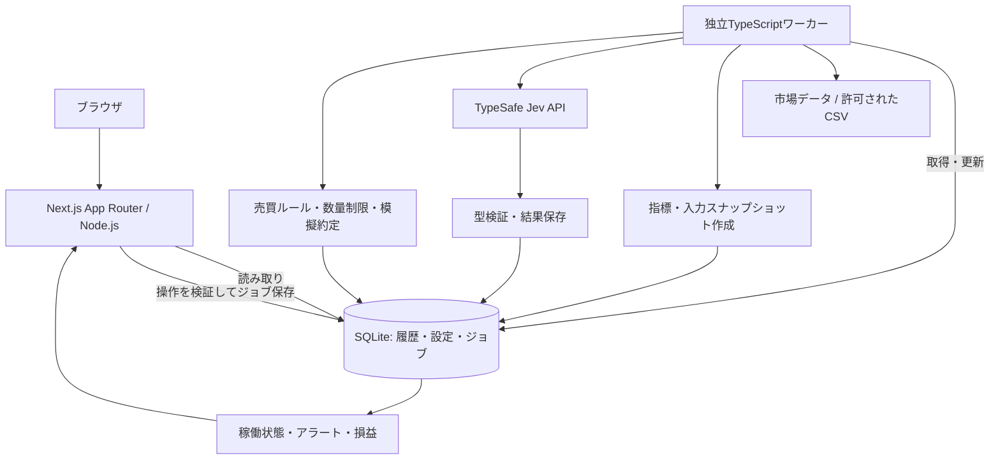

投資商品モニター — Next.js / Jev 実装仕様

更新日：2026-09-18。状態：初期仕様と実装差分。デモ実装を追加済み。実API接続、クラウドDB、投資成績は未検証。

**実装時の変更と現在の到達点**

後続のVercel配置要件に合わせ、ローカルではSQLite、VercelではTurso/libSQLを使う構成に変更した。DB操作はDrizzle / better-sqlite3から `@libsql/client` のパラメータ付きSQLへ、UIはTailwindから通常のCSSへ、パッケージ管理はnpmへ変更した。以下の本文は当初の到達目標として保持する。現行の起動・配置手順は [README.md](README.md) を優先する。

画面、認証付きRoute Handlers、デモデータ、Jevアダプター、永続ジョブ、アラート、模擬運用、DBバックアップ用CLIを実装した。Server Actionsではなく共通の検証付きPOST APIを使用する。Vercelでは `after()` の短時間実行と日次Cron、常駐環境では独立ワーカーを使う。ジョブはDBに保存されるが、Cronのみの構成は即時再試行を保証しない。

VercelのProduction / Previewに別々のTurso DBを接続し、ログイン、保存、模擬評価、模擬口座、Cron、新しいセッションからの再取得まで確認した。詳しい結果は [DEPLOYMENT.md](DEPLOYMENT.md) に記録する。市場データのページ単位の再開、排他リース、HTTP実行前の試行記録、実現・含み損益の個別表示を追加した。分割係数の自動検出と企業行動の手動登録により、対応できない保有期間を停止・検証対象外にする。

実市場向けの未達項目は、実APIの疎通検証、企業行動による保有・現金の自動補正、取引所休日の処理、プロバイダーから取得する正確な売買単位、厳密な履歴再現バックテスト。実市場の収益評価や実発注へ進む前に別途実装・検証する。現時点の制限はREADMEにも明示する。

**1. このファイルの使い方**

このファイルを新しい開発リポジトリのルートに`PROJECT.md`として置き、実装の基準にする。以前のPython / Streamlit構成を、Next.js / TypeScript中心の構成に置き換える。SQLiteと、画面から独立して動く定期処理の方針は引き継ぐ。

実装者はまず既存コードとAGENTS.mdを確認し、本仕様の段階順に実装する。新規プロジェクトであればNext.js App Routerで開始する。外部APIキーがなくても、明示的なデモモードで主要な画面と操作を検証できる状態まで完成させる。未接続の機能を接続済みと表示しない。

**2. 目的と初期スコープ**

ユーザーが見たい投資商品を登録し、価格・出来高の推移、関連情報、Jevによる評価、模擬運用の損益を一つのアプリで確認できるようにする。価格と出来高を「資金流入額」と呼ばない。実際の資金フロー指標は、対応するデータを導入した場合に追加する。

初期版は日本語UI、個人利用、国内株式・ETF、JPY、日足を対象とする。これは商品未定の状態で開発を進めるための初期設定であり、確定した投資方針ではない。他の商品はデータプロバイダーを追加して対応する。

MVPに含めるもの：

- 商品検索・ウォッチリスト登録・解除。
- 日足価格と出来高、移動平均、期間騰落率、商品間の比較。
- 許諾済み開示情報またはユーザー提供資料の登録とJev評価。
- 評価履歴、評価時点の入力、資料リンク、確信度の表示。
- 価格・評価条件に対する画面内アラート。
- 現物の買いと売却を対象にした模擬運用、コスト込み成績、Jevなしとの比較。
- データ取得・Jev・ワーカーの状態、再試行、バックアップ。

将来の拡張：対応商品追加、リアルタイム配信、常時稼働ホスト、SBI証券への注文接続。SBI実発注、口座ログイン自動化、信用・レバレッジ取引、出金、多人数向け公開は初期版の実装対象に含めない。

**3. 技術選定**

| 層 | 採用するもの | 方針 |
|---|---|---|
| Web | Next.js App Router / React / TypeScript strict | 開始時点の安定版と互換Reactを選び、lockfileを保存 |
| Runtime | サポート中のNode.js LTS | Next.jsとネイティブSQLiteドライバーの対応を確認してバージョン固定 |
| UI | Tailwind CSS、必要なアクセシブルUI部品 | 日本語、レスポンシブ、キーボード操作対応 |
| Chart | Lightweight Chartsを候補とするClient Component | ローソク足・出来高・折れ線。採用時に現行APIとライセンス表示要件を確認 |
| 入力検証 | Zod | フォーム、API、環境変数、外部応答の実行時検証 |
| DB | SQLite / better-sqlite3 / Drizzle ORM | 同一ホストの永続ローカルディスク。migrationはGit管理 |
| 金額 | decimal.js等の十進演算 | DBとJSONでは正規化した十進文字列。Numberへの変換はチャート表示だけ |
| AI | TypeSafe Jevの公式HTTP API | サーバー側fetchをアダプターで包み、秘密鍵を隔離 |
| 定期処理 | 独立したNode.js / TypeScriptワーカー | Webのリクエスト寿命に依存させない |
| 検証 | Vitest / Playwright | 計算、再実行、契約、主要操作の検証 |
| 開発 | pnpm、ESLint、TypeScript、tsx | pnpm版も固定。lintをbuildと別に実行 |

Pythonは初期版の必須依存から外す。高度な分析が必要になった場合に、固定した入出力契約を持つ分析サービスとして追加できる構成にする。

Next.jsの初期化、Node要件、lintについては[公式インストール案内](https://nextjs.org/docs/app/getting-started/installation)、DrizzleのSQLite接続については[公式ガイド](https://orm.drizzle.team/docs/sqlite/get-started-sqlite)を実装時に確認する。

**4. アーキテクチャ**



Next.jsとワーカーは同一リポジトリ、同一ホスト、同一DBパスを使う二つのプロセス。DB接続は各プロセスで持ち、短いトランザクションで協調する。

初期導入はローカルPC。継続稼働時は永続ディスクを持つ単一ホストへ移す。Webの複数レプリカやSQLiteファイルをネットワーク越しに共有する構成を採らない。Next.jsのセルフホスト方式は[公式ガイド](https://nextjs.org/docs/app/guides/self-hosting)を参照する。

Vercel等のサーバーレス環境への移行は別の構成変更として扱う。このローカルSQLiteと常駐ワーカーの構成をそのまま配置しない。移行時は共有DB、耐久性のあるジョブ実行基盤、認証を選定する。

**5. 画面とユーザーフロー**

| URL | 画面 | 必須要素 |
|---|---|---|
| `/` | ダッシュボード | 登録商品、騰落、最新アラート、最終更新、ワーカー状態 |
| `/watchlist` | ウォッチリスト | 商品検索、追加・削除、並び順、価格・市場・通貨・価格時点 |
| `/instruments/[id]` | 商品詳細 | ローソク足、出来高、指標、期間切替、開示と評価タイムライン |
| `/compare` | 商品比較 | 共通基準日を100とした推移、対象期間、欠損表示 |
| `/evaluations` | Jev評価履歴 | 商品・日付で絞り込み、分類、確信度、資料、処理状態 |
| `/evaluations/[id]` | 評価詳細 | 入力スナップショット、質問版、モデル名、回答分布、API使用量 |
| `/paper` | 模擬運用 | 仮想現金、保有、実現・含み損益、資産曲線、最大ドローダウン |
| `/alerts` | アラート | 条件編集、発火履歴、既読状態 |
| `/settings` | 設定と稼働状況 | 接続状態、処理待ち、失敗履歴、更新設定、バックアップ案内 |

標準フローは「商品検索 → 登録 → 初回データ取得 → チャート確認 → 資料の評価依頼 → 評価確認 → 模擬運用で比較」。商品解除時は監視を停止し、過去の評価・模擬運用履歴を残す。

PCでは一覧と詳細を読みやすく配置し、スマートフォンでは一列にする。商品詳細はチャートを主役とし、右側または下にJev評価を置く。内部ジョブIDやDB名は通常の投資画面に表示せず、必要時の詳細情報にまとめる。

共通表示ルール：

- 「価格時点」「取得元」「日次 / 遅延 / リアルタイム / デモ」を明示する。
- 上昇・下落は符号やラベルでも区別し、色だけに依存しない。
- 読込中、空、未設定、未対応、入力不足、失敗、古いデータを別状態にする。
- 取得失敗時は最後の有効データを時刻付きで残す。値を0に置き換えない。
- Jevのconfidenceは「評価の確信度」。勝率や期待収益率と表示しない。
- チャートには表形式の代替表示を用意する。
- デモ市場データとデモAI応答はそれぞれ明示する。実接続の失敗時に黙ってデモへ切り替えない。

**6. Next.jsの実装規約**

初期表示はServer Componentからアプリケーションサービスを直接呼び、DBを読む。自分自身のHTTP APIをServer Componentから呼ばない。フォームやチャート、ポーリングなど操作が必要な部分だけClient Componentにする。

書込みはServer Actions、ブラウザの定期読取りはGET Route Handlersを基本とする。Server Actionsも外部から呼ばれ得るサーバー入口として、すべての引数、利用者コンテキスト、操作権限を検証する。型宣言だけを検証の代替にしない。

DB・市場データ・Jevを呼ぶNext.js側の入口はNode.js runtime。共有のドメイン・repository・worker用モジュールはNext.jsに依存させない。Next.js専用のサーバーアダプターには`server-only`を置くが、スタンドアロンworkerが読み込む共有モジュールにそのマーカーを混ぜない。Client Componentから共有サーバーモジュールへのimportはlint等で禁止する。

画面のデータはリクエスト時に取得し、MVPではCache Componentsを有効にしない。更新が必要なページは動的描画を明示する。GET APIは`Cache-Control: private, no-store`を返し、ブラウザ側の取得も`cache: 'no-store'`を使う。設定変更後は対象ページを更新する。表示キャッシュとJev評価の重複排除は別に実装する。

`params`・`searchParams`等は採用Next.js版の非同期仕様に合わせる。DTOには日付のISO文字列と十進文字列だけを渡し、DB接続、Decimalインスタンス、BigIntを直接React/JSONへ渡さない。日時は明示したタイムゾーンで整形する。

外部APIの取得、定期処理、Jev評価はrender、Client Componentのeffect、Route Handler内の無限ループ、`after()`内の長期処理で動かさない。入口ではジョブを永続化して速やかに返す。

**7. アプリ内APIと操作契約**

以下は自作アプリの内部契約であり、Jevや市場データAPIの仕様を示すものではない。

| 読取りAPI | 用途 |
|---|---|
| `GET /api/watchlist` | 価格時点・鮮度付き登録商品一覧 |
| `GET /api/instruments/search?q=...` | 保存済み商品マスター検索。未対応商品を除外 |
| `GET /api/instruments/[id]/bars?from=...&to=...&interval=1d` | 履歴取得。期間・件数上限を検証 |
| `GET /api/evaluations?instrumentId=...&cursor=...` | ページングされた評価履歴 |
| `GET /api/jobs/[id]` | 明示的に依頼した処理の状態 |
| `GET /api/paper?accountId=...` | 模擬残高・損益 |
| `GET /api/alerts?cursor=...` | アラート履歴 |
| `GET /api/status` | DB、worker、providerの状態。秘密情報は含めない |
| `GET /api/health` | DB接続・スキーマ互換を確認。外部APIへ毎回アクセスしない |

Server Actions：`addToWatchlist`、`removeFromWatchlist`、`requestRefresh`、`requestEvaluation`、`saveAlertRule`、`createPaperRun`、`pausePaperRun`、`resumePaperRun`。二重クリック対策はボタン無効化とDBの一意制約の両方で行う。

応答形は`{ ok: true, data, meta }`または`{ ok: false, error: { code, message, retryable } }`。ジョブ操作成功時は`jobId`と`pending / running / succeeded`を返す。重複要求には既存ジョブを返す。スタックトレースや外部APIの認証ヘッダーは返さない。

ポーリングの初期値は15秒。非表示タブでは止め、失敗時は間隔を延ばす。チャート期間変更時は前の要求を中断し、古い応答が新しい期間を上書きしないようにする。

**8. 市場データの契約**

国内株・ETFの接続候補はJ-Quants API。契約プランで利用できる日足・銘柄マスター・開示の範囲を確認する。J-Quantsの分足・Tickは日次配信で、リアルタイム配信ではない。[JPX公式情報](https://www.jpx.co.jp/markets/other-data-services/j-quants-api/)

`MarketDataProvider`は`capabilities`、`searchInstruments`、`fetchBars`、`fetchEvents`を実装する。共通の戻り値にはprovider、価格時点、公開時点、受信時点、市場の現地取引日、通貨、調整の有無、データ区分を含める。

実装するアダプターは決定的な`DemoProvider`、検証付き`CsvProvider`、契約確認後の`JQuantsProvider`。デモは固定seedで生成し、実在銘柄の実価格に見せない。CSVには商品・日付・OHLCV・通貨を要求し、サイズ・日付・重複・OHLCの大小・非負出来高を検証して取り込む。

プロバイダーごとに取得頻度・制限・利用可能機能を返す。古いかどうかは休場日、配信時刻、契約遅延を含めて判定する。市場データAPIの正確なURLと認証方式は、実装時の公式仕様に従う。

元資料の保存・表示・AIへの外部送信が契約上可能な範囲で利用する。外部送信不可なら価格画面は動かし、当該資料のJev評価は無効にする。資料本文は命令として実行せず、HTMLを無害化して表示する。

**9. Jev連携**

Jevは情報分類と評価を担当する。数値指標、注文数量、金額、模擬約定、損失上限は決定的なTypeScriptコードで扱う。

現時点の公式HTTP契約は以下。認証情報はサーバーまたはworkerの環境変数から取得する。[TypeSafe公式クイックスタート](https://docs.typesafe.ai/introduction/quickstart)

```http
POST https://api.typesafe.ai/v1/systemone
Authorization: Bearer <TYPESAFE_API_KEY>
Content-Type: application/json
```

```json
{
  "model": "jev-latest",
  "state": "評価時点、対象商品、許諾済み資料、計算済み指標を含む入力文字列",
  "questions": {
    "event_type": {
      "type": "choice",
      "instructions": "資料に明記された出来事を分類する。判断できなければunknownを選ぶ。",
      "criteria": {
        "upward_revision": "会社予想の上方修正",
        "downward_revision": "会社予想の下方修正",
        "capital_policy": "自社株買い、増資などの資本政策",
        "other": "その他の出来事",
        "unknown": "情報不足で分類できない"
      }
    }
  }
}
```

これはリクエスト形式の設計例であり、実APIでの成功確認済みコードではない。`jev-latest`は初回動作確認用。固定モデルIDが利用できる場合は固定し、常に要求モデル・応答モデル・質問版・入力ハッシュを保存する。固定できない場合はモデル変更の影響を履歴と比較条件に残す。

追加質問は「業績への方向性（Choice）」「既知資料との重複（Noul）」「重要度（Score）」に分解する。Choice/Scoreの分布とconfidence、Noulの値を型ごとに保存する。Noulにconfidenceを必須要求しない。confidenceは回答分布由来の指標で、売買の勝率ではない。[型の仕様](https://docs.typesafe.ai/introduction)、[confidence仕様](https://docs.typesafe.ai/confidence)

`JevClient.evaluate(snapshot, questionSet)`を唯一の接続入口にする。任意URLを利用者入力から受け取らない。応答JSONの型、選択肢、数値の有限性、0〜1の範囲、要求した質問IDの存在を検証し、知らないメタデータは必要に応じ保持する。回答が無効なら評価失敗とする。

デフォルトの要求期限は30秒、最大試行回数は3回の設定値。401/403は自動再試行せず接続設定の問題として表示。429/一時的5xxではRetry-Afterを尊重し、上限付き指数バックオフを使う。応答喪失後の再試行は課金が重複し得るため各試行を保存する。課金上限はAPI側でも設定できる場合に併用する。

評価一意キーは`account/context + snapshotHash + questionVersion + modelConfigHash + revision`。通常の再読込では既存結果を使う。明示的な再評価だけrevisionを増やし、新しい履歴とする。API使用量は応答値を保存し、料金表未設定なら費用は「未算出」とする。

模擬AI評価は専用`MockJevClient`で生成し、必ず`origin=mock`。本物のJev呼出しと混同しない。長い投資解説はラベル・数値・資料リンクから定型文を組み立て、存在しない根拠やJevが返していない説明を補わない。

**10. データモデル**

| テーブル | 主な項目・責務 |
|---|---|
| `instruments` | id, asset_type, exchange, symbol, name, currency, timezone, lot_size |
| `provider_symbols` | instrument_id, provider, provider_symbol。複合一意制約 |
| `watchlist` | instrument_id（一意）, sort_order, enabled, created_at |
| `bar_revisions` | instrument_id, provider, interval, bar_time, trading_date, available_at, received_at, OHLCV, adjusted, revision_hash |
| `market_events` | instrument_id, provider, source_id, published_at, received_at, content_hash, permitted_content, source_url |
| `input_snapshots` | instrument_id, as_of, created_at, source_ids_json, payload_json, payload_hash |
| `evaluations` | snapshot_id, origin, requested_model, response_model, question_version, dedupe_key（一意）, status, answer_json, started_at, completed_at |
| `evaluation_attempts` | evaluation_id, attempt, status, usage_json, latency_ms, error_code, created_at |
| `strategy_versions` | name, rule_version, config_json, created_at。開始後は変更せず新しい版を作成 |
| `paper_accounts` | id, strategy_version_id, data_origin, initial_cash, currency, state, created_at |
| `paper_orders` | account_id, instrument_id, snapshot_id, side, quantity, order_type, limit_price, status, eligible_after, idempotency_key（一意） |
| `paper_fills` | order_id, fill_key（一意）, quantity, price, fee, slippage_metadata, occurred_at |
| `cash_ledger` | account_id, source_key（一意）, amount, currency, occurred_at |
| `equity_snapshots` | account_id, as_of, cash, market_value, net_equity, source_ids_json |
| `corporate_actions` | instrument_id, source_id, action_type, effective_date, payload_json。配当・分割等 |
| `alert_rules` / `alert_events` | 条件、前回状態、解除条件、発火一意キー、既読 |
| `jobs` | kind, payload_json, idempotency_key（一意）, state, attempt, run_after, lease_owner, lease_until, error_code |
| `service_status` | service, heartbeat_at, last_success_at, last_error_code |
| `audit_events` | event_type, entity_id, occurred_at, redacted_details_json |

日時はUTCのISO形式、日足の取引日は市場の現地日付。価格・金額・数量は正規化した十進文字列で保存し、コードでDecimal演算する。全履歴にはデモ/実データの区別を保持し、同じ仮想口座で混ぜない。

外部キーを有効にする。価格改訂は`instrument_id, provider, interval, bar_time, adjusted, revision_hash`で重複排除。開示はproviderのIDとcontent_hashで改訂を識別。商品＋時刻、評価＋時刻、ジョブ状態＋実行予定にインデックスを作る。

SQLiteはWAL、busy_timeout、短い書込みトランザクションを使用する。Webは設定とジョブ投入、workerは取得履歴・評価・台帳更新を担う。外部HTTP待ちの間にDBトランザクションを保持しない。migrationは起動前の一回だけ実行し、Web/worker双方がスキーマ互換を確認する。

**11. ジョブと運用**

ジョブ種別：`sync_instruments`、`refresh_prices`、`refresh_events`、`evaluate_snapshot`、`advance_paper_run`、`check_alerts`。同一スケジュール枠・商品・入力には同じ一意キーを使用する。

ジョブ状態は`pending → running → succeeded`、一時失敗は`retry_wait → running`、上限到達や恒久失敗は`failed`。claimはトランザクション内の条件付き更新で行う。処理に期限を設け、リース更新を続け、期限切れジョブを再取得可能にする。

workerは一つを原則とし、同一ホストの排他ロックで二重起動を防ぐ。DB内の一意制約と条件付き状態遷移でも重複効果を防ぐ。模擬約定と現金台帳は同一トランザクションで保存する。

SIGTERMでは新規claimを止め、実行中の処理を期限内に終えるか復旧可能な状態にする。Webを閉じてもworkerは継続するが、PCスリープ中は停止する。画面ではheartbeatが古い場合に「更新処理停止」と表示する。

日足取得は契約データの公開予定と営業日カレンダーに従う。新しいデータがなければJevを呼ばない。定期処理の状態はDBに保存し、再起動直後の一斉実行を制限する。日次バックアップはSQLiteのオンラインバックアップ機能等を使い、WAL稼働中のDB本体だけを単純コピーしない。

**12. 模擬運用の仕様**

模擬運用には一つの明文化したルールを実装し、閾値と質問版を固定して開始する。最初は日足移動平均などの価格条件に、Jevの材料評価を任意フィルターとして追加する。これは動作と差分を検証する仮説であり、利益が実証された戦略として表示しない。

同じ初期資金・期間・約定条件で「価格ルールのみ」と「価格ルール＋Jev」を比較する。利用者が仮想初期資金、最大配分、最大保有数、日次損失停止値を指定する。実資産額を仮定しない。

MVPの約定モデルは、意思決定完了後の最初の取引可能な日足始値に設定スリッページを加える方式。発表日が同じでも取得・評価が翌営業日の開始に間に合わなければ、その開始価格を使わない。未確定バー・未来情報・同じ終値での後出し約定を禁止する。

指値・逆指値の高度な模擬約定は後続段階とする。日足の高安だけではバー内の順序や約定可能数量が確定しないことをモデルに反映する。板がない状態で実取引と同等の約定精度を主張しない。

手数料、価格に織り込んだスリッページ、AI費用、データ費用を区別する。スリッページを約定価格と追加費用で二重に差し引かない。比較口座への共通費用配分を固定し、税引前・税未計算であることを表示する。手入力費用は見積値と識別する。

保有は約定から、現金は台帳から再構築できること。分割・配当は未調整価格とコーポレートアクションで整合させる。初期実装で対応できないイベントを検出した期間は「検証対象外」とし、保有や成績を黙って計算し続けない。欠損・売買停止では約定を生成しない。

過去資料を現在のAIで評価するバックテストには学習情報の混入を排除できないため、過去検証と「判断を先に記録する実時間模擬運用」を別表示にする。

**13. 設定と秘密情報**

`.env.example`には以下のキー名と安全な初期値だけを置く。Next.jsとworkerは同じ環境設定を明示的に読み込み、別プロセスの自動読込を前提にしない。

```dotenv
APP_MODE=demo
DATABASE_PATH=./data/investment-monitor.sqlite
MARKET_DATA_PROVIDER=demo
JEV_PROVIDER=mock
TYPESAFE_API_KEY=
TYPESAFE_MODEL=jev-latest
JQUANTS_API_KEY=
APP_TIMEZONE=Asia/Tokyo
WORKER_POLL_MS=2000
JEV_TIMEOUT_MS=30000
JEV_MAX_ATTEMPTS=3
```

`APP_MODE=demo`は外部接続なしを標準とする。実接続には明示的にモードとproviderを切り替える。鍵未設定の実接続モードは設定エラー。実市場データとJevが未接続でも、蓄積データやデモ機能の確認を妨げない。

秘密情報を`NEXT_PUBLIC_`に置かない。`.env*`（exampleを除く）、`data/`、バックアップはGit管理外。エラー出力から鍵と個人情報を除く。API鍵は表示・ログ・DBに保存しない。

初期Webは127.0.0.1にバインドする。変更操作はOrigin/Hostと入力を検証し、GETで副作用を起こさない。外部に公開する段階では認証と所有者認可を全入口に追加し、localhost向けの前提を持ち越さない。

**14. 推奨ディレクトリ**

```text
investment-monitor/
  PROJECT.md
  src/
    app/
      layout.tsx
      page.tsx
      loading.tsx
      error.tsx
      watchlist/page.tsx
      instruments/[id]/page.tsx
      compare/page.tsx
      evaluations/page.tsx
      evaluations/[id]/page.tsx
      paper/page.tsx
      alerts/page.tsx
      settings/page.tsx
      api/                         # 読取り・状態確認用Route Handlers
    components/
      charts/                      # Client Components
      watchlist/
      evaluations/
      paper/
      ui/
    server/                        # Next.js専用: Actions、server-only境界
    core/
      domain/                      # Next.jsに依存しない型・ルール
      providers/                   # Demo / CSV / J-Quants
      jev/                         # API、mock、質問、応答検証
      analysis/                    # 指標・スナップショット
      strategies/
      risk/
      paper/
      alerts/
      storage/                     # Drizzle schema / repositories
      jobs/
      config/
    worker/
      main.ts
      scheduler.ts
      handlers/
  scripts/                         # seed、migration、backup、restore
  drizzle/                         # SQL migrations
  fixtures/                        # 明示的な合成データとAPI fixture
  tests/unit/
  tests/integration/
  tests/e2e/
  public/
  data/                            # Git管理外
  .env.example
  package.json
  pnpm-lock.yaml
  next.config.ts
  tsconfig.json
  tsconfig.worker.json
```

workerの本番ビルドはWebと別に行い、実行時に解決できないNext.jsのpath aliasを残さない。共有コードのESM/CJS設定とbetter-sqlite3のビルド環境を合わせ、配布形態で実行確認する。

**15. 実装順序と受け入れ条件**

| 段階 | 実装内容 | 受け入れ条件 |
|---|---|---|
| 1 | Next.js、SQLite migration、合成seed、画面共通枠 | キーなしで起動。デモ表記。DB再起動後も履歴が残る |
| 2 | 検索・watchlist・商品詳細・比較 | 商品追加からチャート表示まで操作でき、期間・銘柄の変更が一致する |
| 3 | worker、ジョブ、CSV、市場データアダプター | Webを閉じても取得可能。二重取込なし。停止と失敗が画面に出る |
| 4 | Jev接続・mock・評価履歴 | 実API契約を検証し、入力・モデル・質問を追跡。再描画で再呼出ししない |
| 5 | アラート・模擬運用・費用比較 | 同じイベントで連続発火せず、台帳と残高が一致。未来情報を使わない |
| 6 | 復旧・バックアップ・起動説明 | worker強制終了後も重複約定なし。バックアップから復元可能 |

環境にキーがない場合は、実APIを使う受け入れ項目を「未検証」と明示し、fixture/mockで検証した項目と分けて報告する。画面だけ作って、取得・保存・評価・模擬運用の処理が実装済みであるように報告しない。

提供するpackage scripts：`dev`、`worker:dev`、`build`、`worker:build`、`start`、`worker:start`、`db:migrate`、`db:seed`、`db:backup`、`db:restore`、`typecheck`、`lint`、`test`、`test:e2e`。これらは実装時に用意する契約であり、現在存在するコマンドではない。

**16. 必須の検証**

| 対象 | 検証内容 |
|---|---|
| 数値・時刻 | Decimal計算、取引単位、欠損、前営業日比、UTCと取引日、将来データ排除 |
| DB・ジョブ | 同一要求の同時投入、リース期限、再起動、価格改訂、一意制約、migration |
| Jev | 正常Choice/Score/Noul、不足質問、未知選択肢、範囲外、401、429、timeout、再評価 |
| 模擬運用 | 残高不足、二重約定、次の有効始値、コスト、分割・配当、売買停止、日次停止 |
| UI | 登録→チャート→評価→履歴→模擬損益、空・失敗・古いデータ、モバイル・キーボード |
| 境界 | Client bundleに鍵やDBコードが入らない、変更操作の入力検証とOrigin確認 |
| 配布 | lint、Webとworkerの型検査・build、本番起動、DB永続化、バックアップ復元 |

定期テストは外部課金なしで実行する。実APIの疎通は別コマンドとし、少数の固定入力で実施する。モデルの出力値そのものを決め打ちせず、応答契約と保存・表示を確認する。

**17. 完成の定義とSBI拡張**

完成時には、起動方法、環境変数、デモと実接続の切替、データ契約上の前提、テスト結果、未検証項目をREADMEに記す。契約済みのキーを設定すれば実データ・Jev評価へ切り替えられ、キーなしでは同じ操作経路をデモで確認できること。

SBI注文接続は、対応商品の確定と接続方式の確認後に`BrokerAdapter`として追加する。公式案内の先物・オプションAPIは外部ツール登録を前提としており、自作アプリからの直接接続可否は未確認。API仕様や架空のSBIエンドポイントを作らない。[SBI公式案内](https://www.sbisec.co.jp/ETGate/?OutSide=on&_ActionID=DefaultAID&_ControlID=WPLETmgR001Control&_PageID=WPLETmgR001Mdtl20&burl=search_op&cat1=op&cat2=none&dir=service&file=op_service_05.html&getFlg=on)

実注文を導入する段階では、模擬注文と口座・テーブル・実行経路を分離し、注文照会、部分約定、取消、通信断後の照合、損失制限を改めて実装・検証する。現在のPROJECT.mdは監視・評価・模擬運用を完成させるための仕様とする。
